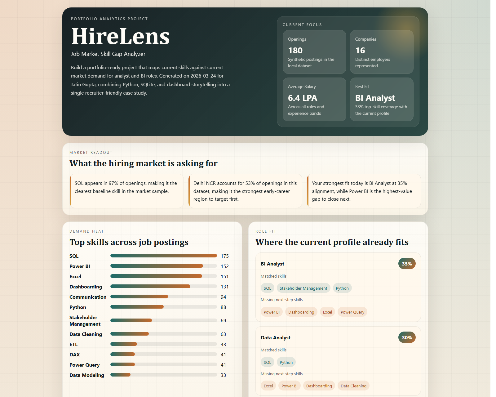
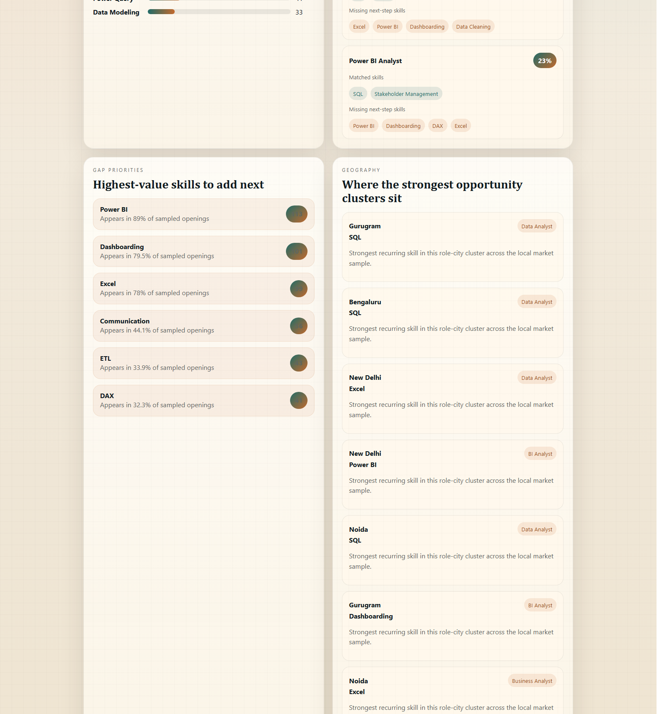
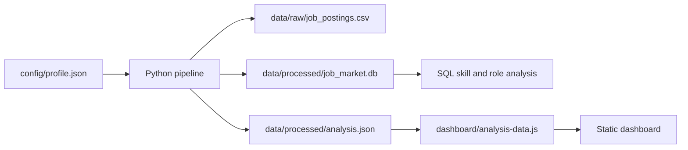

# HireLens

HireLens is a job market skill gap analyzer built to answer a practical question:

Which analyst roles best match the current profile, and which skills should be learned next to become more competitive in the market?

It combines a structured local job-market dataset, a Python analysis pipeline, SQLite-based querying, and a static dashboard to turn raw role-demand signals into recruiter-friendly insight.

> Note: this version uses a synthetic but realistic local dataset so the full workflow can be demonstrated end to end without external API dependencies.

## Demo Preview

### Dashboard Overview



### Analytics Detail View



## Why This Project Matters

Most student analytics projects stop at dashboards or model accuracy. HireLens goes one step further by connecting analytics to a real decision:

- which roles are most aligned with the current profile
- which skills appear most often across target jobs
- which gaps are worth prioritizing next
- how to turn those gaps into a focused learning roadmap

That makes the project useful not only as an analytics case study, but also as a strong portfolio story for internships and entry-level analyst roles.

## Current Output Snapshot

From the current generated analysis:

- `180` job postings were modeled in the local dataset
- `16` companies are represented in the sample
- `BI Analyst` appears as the strongest-fit target role
- `Power BI` is the highest-value skill gap to close next
- `SQL` appears as the strongest baseline skill across the market sample

## Core Features

- models analyst and BI job postings across major Indian cities
- stores data in both CSV and SQLite formats
- analyzes top skills, city clusters, work modes, salary patterns, and role demand
- compares current profile skills against market demand for target roles
- calculates role-fit scores and identifies missing high-value skills
- generates a three-month upskilling roadmap
- presents the final story in a polished static dashboard

## Tech Stack

- `Python`
- `SQL`
- `SQLite`
- `HTML`
- `CSS`
- `JavaScript`

## How It Works



### Pipeline Flow

1. A synthetic dataset of analyst and BI roles is generated with title, city, company, salary, experience level, and required skills.
2. The dataset is loaded into SQLite and normalized into job and skill tables.
3. The current profile from `config/profile.json` is compared against market demand.
4. Role-fit scores, skill-gap priorities, and market insights are calculated.
5. The outputs are exported into JSON and dashboard-ready JavaScript.
6. A static frontend presents the analysis through cards, charts, highlights, and a learning roadmap.

## Project Structure

- `config/profile.json`
  Candidate profile, current skills, and target roles used for gap analysis
- `scripts/build_pipeline.py`
  Generates the dataset, builds the SQLite database, calculates insights, and exports dashboard-ready outputs
- `data/raw/job_postings.csv`
  Generated job posting dataset
- `data/processed/job_market.db`
  SQLite database for structured querying
- `data/processed/analysis.json`
  Final analysis output used by the dashboard
- `dashboard/index.html`
  Portfolio-style frontend
- `dashboard/styles.css`
  Visual design and layout
- `dashboard/app.js`
  Rendering logic for cards, charts, tables, and roadmap
- `sql/market_queries.sql`
  Reusable SQL analysis queries
- `docs/`
  README screenshots for GitHub preview

## Run Locally

### 1. Generate the data and analysis outputs

```powershell
python scripts/build_pipeline.py
```

### 2. Open the dashboard

Open `dashboard/index.html` directly in a browser, or serve the folder locally:

```powershell
python -m http.server 8000 -d dashboard
```

Then visit:

```text
http://localhost:8000
```

## Customization

To personalize the analysis, edit:

- `config/profile.json`

You can change:

- target roles
- current skills
- learning goal

Then rerun the pipeline to regenerate the outputs.

## Why It Works Well In A Portfolio

- it combines `Python + SQL + dashboarding` in one project
- it has a clear business-style problem statement
- it produces measurable outputs instead of only code
- it shows both analysis and storytelling
- it creates a natural interview conversation around skills, hiring trends, and decision-making

## Next Improvements

- replace the synthetic dataset with scraped or manually collected job-board data
- add filters by city, role, and experience level
- extend the pipeline with resume parsing and keyword matching
- convert the dashboard into a deployable React or Next.js app
- publish a live hosted version with interactive filters
